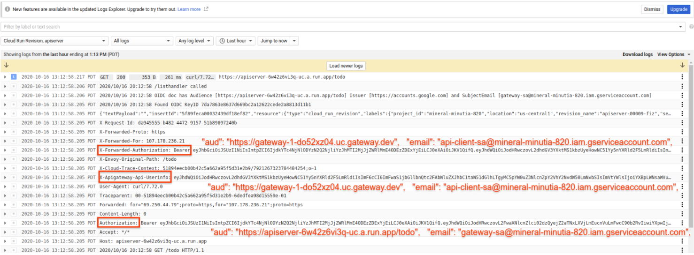

## API Gateway -> Cloud RUn Auth Helloworld

Simple tutorial to secure an API you deploy on Cloud Run behind GCP [API Gateway](https://cloud.google.com/api-gateway/docs)

Basically

`client --> API Gateway --> API Server`

where each of the components is secure and will only allow authenticated clients through.

We will deploy each of these components from scratch and add on the IAM permissions required as well as the JWT Auth audience checks


### Setup

```bash
export PROJECT_ID=`gcloud config get-value core/project`
export PROJECT_NUMBER=`gcloud projects describe $PROJECT_ID --format='value(projectNumber)'`
```

Create Service accounts:

```bash
# Service account the API Gateway runs as
gcloud iam service-accounts create gateway-sa  --display-name "Service Account for API Gateway"

# Service account your API Server runs as
gcloud iam service-accounts create api-sa  --display-name "Service Account for API"

# Service account and key a client will use to call the gateway
gcloud iam service-accounts create api-client-sa  --display-name "Service Account for API Client"
gcloud iam service-accounts keys  create svc_client.json --iam-account=api-client-sa@$PROJECT_ID.iam.gserviceaccount.com
```


## Deploy API

```bash

# build and deploy
gcloud builds submit --tag gcr.io/$PROJECT_ID/apiserver .

gcloud beta run deploy apiserver  --image gcr.io/$PROJECT_ID/apiserver \
   --region us-central1  --platform=managed  -q
```

We need to find the auto-assigned URL for this api server...we're only doing this because i'm paranoid and have a handler in the deployed API that
always decodes and verifies the inbound header (even if Cloud Run would validate it!)
eg. see `authMiddleware()` middleware function in `main.go`

```golang
	router := mux.NewRouter()
	router.Methods(http.MethodGet).Path("/todo").HandlerFunc(listhandler)

	var server *http.Server
	server = &http.Server{
		Addr:    *httpport,
		Handler: authMiddleware(router),
	}
```

Anyway, fist find the URL

```bash
export ALLOWED_AUDIENCE_URL=`gcloud run services describe apiserver --format="value(status.url)"`/todo
echo $ALLOWED_AUDIENCE_URL
```

Then specify that URL as the audience to check for as an argument to the API like this:

```bash
gcloud beta run deploy apiserver  --image gcr.io/$PROJECT_ID/apiserver \
   --region us-central1  --platform=managed \
   --service-account=api-sa@$PROJECT_ID.iam.gserviceaccount.com \
   --args="--allowedAudience=$ALLOWED_AUDIENCE_URL" -q
```
At this point, the API backend always doublechecks the audience and will


Now allow the Gateway's Service account permissions to access the API backend

```bash
gcloud run services add-iam-policy-binding apiserver --region us-central1 \
    --platform=managed --member=serviceAccount:gateway-sa@$PROJECT_ID.iam.gserviceaccount.com \
    --role=roles/run.invoker
```


### Deploy Gateway

Allow the API Gateway's service account permissions to do admin stuff (TODO: there doens't seem to be a way to allow thsi service account permissions on specific APIs...its a binding at the project level, unfortunately)

```bash
gcloud projects add-iam-policy-binding $PROJECT_ID  \
   --member serviceAccount:gateway-sa@$PROJECT_ID.iam.gserviceaccount.com   --role roles/apigateway.admin
```

Now edit `openapi2-run.yaml`, enter in the values here that you have for the backend API (remember to keep the trailing `/todo`)

```yaml
      x-google-backend:
        address: $ALLOWED_AUDIENCE_URL/todo
```

now Create the gateway Config

```bash
gcloud beta api-gateway api-configs create config-1 --api=api-1 --openapi-spec=openapi-run.yaml \
   --backend-auth-service-account=gateway-sa@$PROJECT_ID.iam.gserviceaccount.com
```

Create the Gateway

```
gcloud beta api-gateway gateways create gateway-1 \
  --api=api-1 --api-config=config-1 \
  --location=us-central1
```

We need to "secure" the gateway with security specification which allows **ANY** google signed OIDC token with the right
audience through. Right, we're securing it such that any google issued OIDC token is allowed through that has the audience value....

Find the hostname of the gateway

```bash
export GATEWAY_HOSTNAME=`gcloud beta api-gateway gateways describe gateway-1  --location=us-central1 --format="value(defaultHostname)"
```

Then `openapi2-run.yaml` and enter value under the security definitions of `x-google-audiences`

```yaml
securityDefinitions:
  google_id_token:
    authorizationUrl: ""
    flow: "implicit"
    type: "oauth2"
    x-google-issuer: "https://accounts.google.com"
    x-google-jwks_uri: "https://www.googleapis.com/oauth2/v3/certs"
    x-google-audiences: "https://$GATEWAY_HOSTNAME"    

```

As mentioned, this allows any OIDC token that happens to have the right audience value through.  If you wanted to make this a private API, you would 
use a different JWT issuer (eg, a service account you own)


Now deploy as `config-2`

```bash
gcloud beta api-gateway api-configs create config-2 --api=api-1 --openapi-spec=openapi-run.yaml \
   --backend-auth-service-account=gateway-sa@$PROJECT_ID.iam.gserviceaccount.com

gcloud beta api-gateway gateways update gateway-1 \
  --api=api-1 --api-config=config-2 \
  --location=us-central1
```


## CALL API

We're ready now to call the gatway

First bootstrap gcloud with the client's service account
```bash
gcloud auth activate-service-account --key-file=`pwd`/svc_client.json
```


Then get an OIDC token that has an audience that matches the gateway

```bash
export ID_TOKEN=`gcloud auth print-identity-token --audiences=https://$GATEWAY_HOSTNAME`
```

Note the OIDC token's issuer and audience:

```json
{
  "aud": "https://gateway-1-do52xz04.uc.gateway.dev",
  "azp": "api-client-sa@mineral-minutia-820.iam.gserviceaccount.com",
  "email": "api-client-sa@mineral-minutia-820.iam.gserviceaccount.com",
  "email_verified": true,
  "exp": 1602882463,
  "iat": 1602878863,
  "iss": "https://accounts.google.com",
  "sub": "108281515051350346015"
}
```


now call the gateway with the token

```bash
curl -v -H "Authorization: Bearer $ID_TOKEN" https://$GATEWAY_HOSTNAME/todo
```

What you should see is the "api" backend on cloud run returning the serivce account it saw in the `Authorization` header it got.  In our case its a token  that identifies the inbound requestor (i.,e the gateway)

(`gateway-sa@mineral-minutia-820.iam.gserviceaccount.com`)


That is...its a simple api doing simple things....and yeah, i "secured" the gateway to allow any google OIDC token with the right audience...in reality, you'll likely want to use yoru own service account or other JWT issuer.

You can also integrate the gateway and cloud run to support users and enriched webapps....a colleague of mine is gonna write that up in a bit


So...here are the headers and decoded JWTs

#### Client -> Gateway


This is the JWT token issued by the client.  Note the audience and issuer

```bash
gcloud auth print-identity-token --audiences=https://gateway-1-do52xz04.uc.gateway.dev
{
  "aud": "https://gateway-1-do52xz04.uc.gateway.dev",
  "azp": "api-client-sa@mineral-minutia-820.iam.gserviceaccount.com",
  "email": "api-client-sa@mineral-minutia-820.iam.gserviceaccount.com",
  "email_verified": true,
  "exp": 1602882463,
  "iat": 1602878863,
  "iss": "https://accounts.google.com",
  "sub": "108281515051350346015"
}
```

I used gcloud to create this OIDC token but you can ofcourse use any other language/api
see [Authenticating using Google OpenID Connect Tokens](https://github.com/salrashid123/google_id_token)


#### Appendix

These are the header and JWTs as seen byt your API server



#### Gateway --> Backend


- `X-Forwarded-Authorization`

 The original header sent by the client
```json
{
  "aud": "https://gateway-1-do52xz04.uc.gateway.dev",
  "azp": "api-client-sa@mineral-minutia-820.iam.gserviceaccount.com",
  "email": "api-client-sa@mineral-minutia-820.iam.gserviceaccount.com",
  "email_verified": true,
  "exp": 1602882463,
  "iat": 1602878863,
  "iss": "https://accounts.google.com",
  "sub": "108281515051350346015"
}
```

- `X-Apigateway-Api-Userinfo`

This is the same as above except that its not a signed JWT (its just the claims part)

```json
{
  "aud": "https://gateway-1-do52xz04.uc.gateway.dev",
  "azp": "api-client-sa@mineral-minutia-820.iam.gserviceaccount.com",
  "email": "api-client-sa@mineral-minutia-820.iam.gserviceaccount.com",
  "email_verified": true,
  "exp": 1602882463,
  "iat": 1602878863,
  "iss": "https://accounts.google.com",
  "sub": "108281515051350346015"
}
```


- `Authorization`

This is the header that is sent by the gateway to your api server that gets validated by IAM

```json
{
  "aud": "https://apiserver-6w42z6vi3q-uc.a.run.app/todo",
  "azp": "108234776417428586904",
  "email": "gateway-sa@mineral-minutia-820.iam.gserviceaccount.com",
  "email_verified": true,
  "exp": 1602881043,
  "iat": 1602877443,
  "iss": "https://accounts.google.com",
  "sub": "108234776417428586904"
}
```


